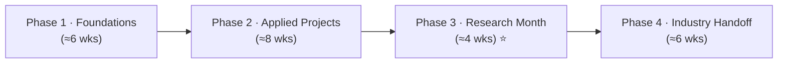

# 🎓 The Academia-to-Industry AI/ML Curriculum

**The structured 6-month AI/ML internship program I designed and ran at TABSAP — with a dedicated research month that most bootcamps skip.**

*This is not advice. It's the curriculum, the evaluation rubric, and the outcomes from a program I built, ran, and validated with real interns.*

---

## Why this exists

There is a real gap between how ML is taught in academia and how it's used in industry. Academia builds rigor and the ability to read papers and push the frontier, but rarely teaches you to ship. Industry builds reliability and scale, but rarely gives you time to understand *why* a method works or to read the paper it came from.

Most bootcamps and internships train only for the industry side. **This program was built to close the gap in both directions** — to produce engineers who can read a paper *and* deploy a service, researchers who can productionize their own ideas.

I ran it as **AI Engineer & Trainer at TABSAP (2024–2026)**. This repository is the public artifact of that program: the philosophy, the full curriculum, the rubric I graded against, and the outcomes.

---

## 📊 Outcomes

> *Real results from an active program — the reason this repo is evidence, not opinion.*

- **9 interns mentored** through the program (M/F).
- **3 have completed** the full 6-month structure; **the rest are currently in progress.**
- Completed work was assessed against the published [evaluation rubric](./evaluation/rubric.md).
- **Publicly recognized** in a student testimonial → _[link to testimonial](#)_ ⬅️ *([drop your testimonial URL here](https://www.linkedin.com/feed/update/urn:li:activity:7484713579577872384/?utm_source=share&utm_medium=member_desktop&rcm=ACoAAFYOchoBi3tx1Yq9hvzJOQ16zm7Koq59VHI))*
- A **dedicated research month** — the structural differentiator that gives interns a taste of genuine research, not just applied tutorials.

*(This is a living program — bump the completion count as more interns finish.)*

---

## 🧭 Program philosophy

Three principles shaped every phase:

1. **Evidence before opinion.** Interns learned to make claims they could back with results — the same standard as a research paper or a production postmortem.
2. **Rigor is transferable.** The habits that make good research — controlled experiments, honest baselines, reproducibility — make better engineers too. The program deliberately carries research discipline *into* applied work.
3. **Ship *and* understand.** Every intern had to both deploy something that worked *and* explain why it worked. Neither alone was enough to pass.

---

## 🗂️ The curriculum

A 6-month arc, layered from fundamentals to independent work. Each phase links to its own detailed breakdown.

| Phase | Focus | Detail |
|------|-------|--------|
| **1 · Foundations** | ML fundamentals, tooling, the workflow, evaluation done right | [01_foundations.md](./curriculum/01_foundations.md) |
| **2 · Applied Projects** | Real end-to-end projects — data engineering to a working model | [02_applied_projects.md](./curriculum/02_applied_projects.md) |
| **3 · Research Month ⭐** | Read, reproduce, and extend a paper. The differentiator. | [03_research_month.md](./curriculum/03_research_month.md) |
| **4 · Industry Handoff** | Deployment, MLOps, and shipping to a real standard | [04_industry_handoff.md](./curriculum/04_industry_handoff.md) |

---

## How interns were evaluated

Grading wasn't vibes. Interns were assessed against an explicit [**evaluation rubric**](./evaluation/rubric.md) covering technical depth, reproducibility, communication, and independence — the same dimensions that matter in both a lab and a team. The rubric is public here as evidence of how "Excellent" was actually earned.

---

## 📚 Resources taught

The curated reading and course lists interns worked from:

- 📖 [Books](./resources/books.md)
- 🎥 [Courses](./resources/courses.md)

---

## 🔁 Adapting this for your own cohort

Running a program or a study group? Fork it. The phase structure, the research month, and the rubric are meant to be adapted. If you improve something, a PR back is welcome.

## 🤝 Contributing

Corrections, adaptations, and additional resources are welcome — see [CONTRIBUTING.md](./CONTRIBUTING.md).

## 📄 License

Released under the [MIT License](./LICENSE).

---

*Built and run by [Abdullah Khan](https://github.com/khanaiml) — SciML Researcher & AI/ML Engineer.*
*The research month is the part I'm proudest of: it's what turned interns into people who could think like researchers and ship like engineers.*

